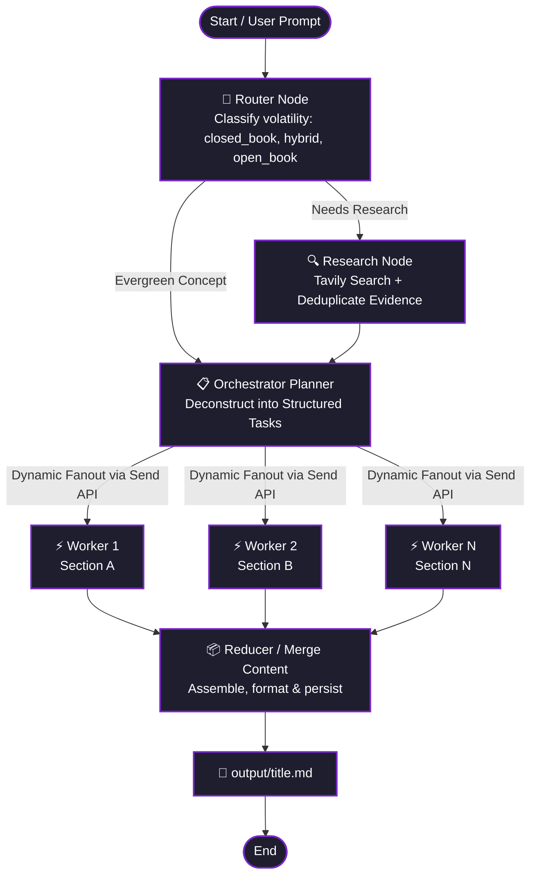

# ✍️ Autonomous Multi-Agent Technical Blog Generator

[](https://www.python.org/)
[](https://github.com/langchain-ai/langgraph)
[](https://ai.google.dev/)
[](https://tavily.com/)

An end-to-end, agentic content generation pipeline powered by **LangGraph**, **Google Gemini**, and **Tavily AI**.

Unlike naive single-prompt generators that suffer from context loss, generic fluff, and hallucinations, this system decomposes technical writing into specialized agents that research, plan, parallelize section drafting, and synthesize publication-ready technical guides.

---

## 💡 Why This Project?

Monolithic LLM prompts often fail at writing comprehensive technical articles:

- **Hallucinations & Stale Info:** Without live retrieval, models invent parameters or reference obsolete libraries.
- **Superficial Coverage:** When forced to write 2,000+ words at once, LLMs skim over critical implementation nuances, trade-offs, and architecture details.
- **Slow Sequential Latency:** Generating section-by-section sequentially takes several minutes.

### The Solution: Multi-Agent Map-Reduce

This system solves these bottlenecks with an agentic workflow:

1. **Intelligent Router:** Analyzes the topic volatility (`closed_book`, `hybrid`, or `open_book`) to determine whether live web research is required.
2. **Web Research & Deduplication:** Queries Tavily for authoritative sources, dates, and snippets, deduplicating findings.
3. **Orchestrator Planning:** Deconstructs the topic into a structured blueprint (5–9 distinct tasks with target word counts, code requirements, and citation flags).
4. **Parallel Worker Fanout (`Send` API):** Workers write each section **concurrently**, cutting generation time by up to 80%.
5. **Reducer & File Persistence:** Merges sections in strict logical order and outputs clean GitHub-flavored markdown directly into `/output`.

---

## 🏗️ Architecture & Workflow



---

## ✨ Key Features

- **Context-Aware Routing:** Distinguishes between foundational knowledge (e.g., _Transformer math_), evolving topics (e.g., _RAG frameworks_), and breaking news (e.g., _latest model releases_).
- **Strict Structured Outputs:** Powered by Pydantic models (`RouterDecision`, `EvidencePack`, `Plan`, `Task`) ensuring zero schema drift across agent handoffs.
- **Dynamic Map-Reduce Fanout:** Utilizes LangGraph's dynamic `Send` primitives to execute section generation concurrently.
- **Deep Technical Grounding:** Enforces MWEs (Minimal Working Examples), failure modes, security considerations, and latency/cost trade-offs in every post.
- **Automatic Export:** Sanitizes filenames and persists formatted articles to `./output/<topic_slug>.md`.

---

## 🚀 Quickstart

### 1. Clone Repository

```bash
git clone https://github.com/your-username/AI-Blog-Generator.git
cd AI-Blog-Generator
```

### 2. Set Up Virtual Environment

```bash
python -m venv .venv

# On Linux/macOS:
source .venv/bin/activate

# On Windows:
.venv\Scripts\activate
```

### 3. Install Dependencies

```bash
pip install -r requirements.txt
```

### 4. Configure API Keys

Copy the example environment file and add your credentials:

```bash
cp .env.example .env
```

Add your keys to `.env`:

```env
GOOGLE_API_KEY="your-google-gemini-api-key"
TAVILY_API_KEY="your-tavily-search-api-key"
```

### 5. Run the Generator

Run with an interactive prompt:

```bash
python main.py
```

Or pass the topic directly via command-line arguments:

```bash
python main.py "Building Production-Ready Vector Search with HNSW and IVF"
```

---

## 📂 Project Structure

```plaintext
AI-Blog-Generator/
├── .env.example              # Template for API keys
├── .gitignore                # Git ignore patterns
├── main.py                   # CLI entrypoint with interactive & argument support
├── pyproject.toml            # Project metadata and dependencies
├── requirements.txt          # Python package requirements
├── README.md                 # Project documentation & architecture
├── output/                   # Directory where generated markdown posts are saved
│   └── rag_101_from_noob_to_pro.md
└── src/
    ├── app.py                # LangGraph StateGraph assembly and compilation
    ├── edges.py              # Conditional edges and dynamic fanout logic
    ├── models.py             # LLM initialization (Gemini 3.5 & 3.1 Flash)
    ├── nodes.py              # Node functions (Router, Research, Orchestrator, Worker, Reducer)
    ├── prompts.py            # Prompt engineering and system instructions
    ├── states.py             # State models and Pydantic schemas (BlogState, Plan, Task)
    └── tools.py              # Tavily web search integration
```

---

## 📖 Sample Generated Output

Check out a full production-grade sample generated by this agent in [`output/rag_101_from_noob_to_pro.md`](output/rag_101_from_noob_to_pro_in_retrieval-augmented_generation.md), featuring:

- **Architecture deep dives:** Detailed breakdown of Ingestion, Retrieval, and Generation.
- **Implementation code:** Python scripts for semantic chunking and BM25 + Reciprocal Rank Fusion (RRF).
- **Production trade-offs:** HNSW vs. IVF-PQ benchmarking and memory analysis.
- **Observability:** Metric monitoring with the RAG triad (Context Relevance, Groundedness, Answer Relevance).

---

## 🛠️ Tech Stack

- **Orchestration:** [LangGraph](https://langchain-ai.github.io/langgraph/)
- **LLM Backbone:** Google Gemini (`gemini-3.5-flash-lite`) via `langchain-google-genai`
- **Web Retrieval:** [Tavily Search API](https://tavily.com/) via `langchain-tavily`
- **Data Validation:** [Pydantic v2](https://docs.pydantic.dev/)
